# Design System

디자인 시스템 컴포넌트 라이브러리

## 🚀 빠른 시작

```bash
npm install
npm run storybook
```

---

## 📝 Jira 연동

### 초기 설정 (최초 1회)

#### 1. GitHub CLI 로그인

```bash
gh auth login
```

#### 2. GitHub Secrets 설정 (관리자)

GitHub Actions가 자동으로 Jira 연동하려면 Secrets 설정이 필요합니다:

**Settings** → **Secrets and variables** → **Actions**

| Secret Name       | 설명             | 예시                                |
| ----------------- | ---------------- | ----------------------------------- |
| `JIRA_BASE_URL`   | Jira URL         | `https://your-domain.atlassian.net` |
| `JIRA_USER_EMAIL` | Jira 이메일      | `your-email@company.com`            |
| `JIRA_API_TOKEN`  | Jira API 토큰    | `your-jira-api-token`               |
| `JIRA_PROJECT`    | Jira 프로젝트 키 | `FMTW`                              |

> 💡 **Secrets는 관리자가 한 번만 설정하면, 모든 팀원이 사용할 수 있습니다**
>
> 💡 Jira API 토큰 생성: https://id.atlassian.com/manage-profile/security/api-tokens

### 주요 기능

#### 1. Jira 티켓 생성

CLI를 통해 대화형으로 Jira 티켓을 생성합니다:

```bash
npm run jira:create
```

- 이슈 제목, 설명, 타입(Task/Story/Bug) 선택
- 상위 티켓 연결 가능
- GitHub Actions를 통해 자동 생성

#### 2. 스마트 커밋

커밋 메시지에 명령어를 포함하여 자동으로 Jira 티켓을 업데이트합니다:

```bash
git commit -m "FMTW-123 버튼 컴포넌트 추가 #comment UI 개선 완료"
```

지원하는 명령어:

- `#comment` - 코멘트 추가
- `#time` - 작업 시간 기록 (1h 30m)
- `#start` - 작업 시작 상태로 전환
- `#resolve` - 완료 상태로 전환
- `#close` - 이슈 닫기

> 📖 자세한 사용법: [scripts/jira/README.md](scripts/jira/README.md)

---

## 🚀 CI/CD 자동 배포

GitHub Actions를 통해 Storybook과 Chromatic이 자동으로 배포됩니다.

### 배포 플로우

```mermaid
graph LR
    A[코드 작성] --> B[develop으로 PR]
    B --> C[코드 리뷰]
    C --> D[develop에 Merge]
    D --> E[CI: Storybook 빌드]
    E --> F[Chromatic 자동 배포]
```



**자동 실행 조건:**

- develop 브랜치에 merge(push) 시

**실행 단계:**

1. Storybook 빌드 검증
2. Chromatic 배포 및 비주얼 회귀 테스트
3. 자동으로 baseline 승인

### 초기 설정 (관리자, 최초 1회)

GitHub Secrets에 Chromatic 토큰을 등록해야 합니다:

**Settings** → **Secrets and variables** → **Actions** → **New repository secret**

| Secret Name               | 값                     |
| ------------------------- | ---------------------- |
| `CHROMATIC_PROJECT_TOKEN` | `chpt_a7a4f2b4972968e` |

### 배포 상태 확인

- GitHub Actions: `Actions` 탭에서 워크플로우 실행 상태 확인
- Chromatic: [chromatic.com](https://www.chromatic.com/)에서 비주얼 변경사항 확인

---

## 🛠️ 주요 명령어

### Storybook

```bash
npm run storybook          # 개발 서버
npm run build-storybook    # 빌드
```

### Jira

```bash
npm run jira:create        # Jira 티켓 생성
npm run commit:help        # 스마트 커밋 도움말
```

---

## 📂 프로젝트 구조

```
design-system/
├── src/
│   ├── stories/              # Storybook 컴포넌트
│   └── figma/                # 디자인 토큰
├── scripts/jira/             # Jira 연동 스크립트
│   ├── create-jira-only.js          # 티켓 생성
│   ├── process-smart-commits.js     # 스마트 커밋 처리
│   └── README.md                    # 상세 가이드
├── .github/workflows/        # GitHub Actions
└── package.json
```

---

## 🤝 기여하기

1. Jira 티켓 생성: `npm run jira:create`
2. feature 브랜치에서 작업
3. 스마트 커밋으로 커밋 및 푸시
4. develop으로 Pull Request 생성
5. 코드 리뷰 및 승인
6. develop에 Merge
7. CI 자동 실행: Storybook 빌드 + Chromatic 배포 ✅

---

## 📄 라이선스

ISC
