# Design System

디자인 시스템 컴포넌트 라이브러리

## 🚀 빠른 시작

```bash
npm install
npm run storybook
```

---

## 📝 Jira 연동

### 초기 설정 (최초 1회)

#### 1. GitHub CLI 로그인

```bash
gh auth login
```

#### 2. GitHub Secrets 설정 (관리자)

GitHub Actions가 자동으로 Jira 연동하려면 Secrets 설정이 필요합니다:

**Settings** → **Secrets and variables** → **Actions**

| Secret Name       | 설명             | 예시                                |
| ----------------- | ---------------- | ----------------------------------- |
| `JIRA_BASE_URL`   | Jira URL         | `https://your-domain.atlassian.net` |
| `JIRA_USER_EMAIL` | Jira 이메일      | `your-email@company.com`            |
| `JIRA_API_TOKEN`  | Jira API 토큰    | `your-jira-api-token`               |
| `JIRA_PROJECT`    | Jira 프로젝트 키 | `FMTW`                              |

> 💡 **Secrets는 관리자가 한 번만 설정하면, 모든 팀원이 사용할 수 있습니다**
>
> 💡 Jira API 토큰 생성: https://id.atlassian.com/manage-profile/security/api-tokens

### 주요 기능

#### 1. Jira 티켓 생성

CLI를 통해 대화형으로 Jira 티켓을 생성합니다:

```bash
npm run jira:create
```

- 이슈 제목, 설명, 타입(Task/Story/Bug) 선택
- 상위 티켓 연결 가능
- GitHub Actions를 통해 자동 생성

#### 2. 스마트 커밋

커밋 메시지에 명령어를 포함하여 자동으로 Jira 티켓을 업데이트합니다:

```bash
git commit -m "✨ Feat: 버튼 컴포넌트 추가 FMTW-123 #comment UI 개선 완료"
```

지원하는 명령어:

- `#comment [내용]` - 코멘트 추가
- `#time [시간]` - 작업 시간 기록 (예: 1h 30m, 2h)

#### 3. PR 머지 시 자동 완료

develop 브랜치로 PR이 머지되면 자동으로 Jira 티켓이 완료 상태로 변경됩니다:

```bash
# 브랜치명 형식: AUR-123-description 또는 feature/AUR-123-description
git checkout -b AUR-123-button-component
# ... 작업 진행 ...
# develop으로 PR 생성 후 머지 → Jira 티켓이 자동으로 완료됨 ✅
```

**자동 실행:**

- PR이 develop에 머지되면 브랜치명에서 티켓 번호 자동 추출
- Jira 티켓 상태를 "완료"로 자동 전환
- PR 링크와 함께 완료 코멘트 자동 추가

> 💡 브랜치명에 Jira 티켓 번호(예: AUR-123)를 포함해야 합니다.
>
> 📖 자세한 사용법: [scripts/jira/README.md](scripts/jira/README.md)

---

## 🚀 CI/CD 자동 배포

GitHub Actions를 통해 Storybook과 Chromatic이 자동으로 배포됩니다.

### 배포 플로우

```mermaid
graph LR
    A[코드 작성] --> B[develop으로 PR]
    B --> C[코드 리뷰]
    C --> D[develop에 Merge]
    D --> E[CI: Storybook 빌드]
    E --> F[Chromatic 자동 배포]
```



**자동 실행 조건:**

- develop 브랜치에 merge(push) 시

**실행 단계:**

1. Storybook 빌드 검증
2. Chromatic 배포 및 비주얼 회귀 테스트
3. 자동으로 baseline 승인

### 초기 설정 (관리자, 최초 1회)

GitHub Secrets에 Chromatic 토큰을 등록해야 합니다:

**Settings** → **Secrets and variables** → **Actions** → **New repository secret**

| Secret Name               | 값                     |
| ------------------------- | ---------------------- |
| `CHROMATIC_PROJECT_TOKEN` | `chpt_a7a4f2b4972968e` |

### 배포 상태 확인

- GitHub Actions: `Actions` 탭에서 워크플로우 실행 상태 확인
- Chromatic: [chromatic.com](https://www.chromatic.com/)에서 비주얼 변경사항 확인

---

## 🛠️ 주요 명령어

### 패키지 빌드 및 배포

```bash
npm run build              # 패키지 빌드 (dist/ 폴더 생성)
npm publish --dry-run      # 배포 테스트 (실제 배포 안 함)
npm publish                # Nexus에 배포
```

### Storybook

```bash
npm run storybook          # 개발 서버
npm run build-storybook    # 빌드
```

### 커밋

```bash
npm run commit             # 인터랙티브 커밋 (권장)
```

인터랙티브 CLI로 질문에 답하면 자동으로 규칙에 맞는 커밋 메시지가 생성됩니다.

**커밋 방법:**

1. **인터랙티브 CLI** (권장): `npm run commit` - 단계별 안내 + 스마트 커밋 지원
2. **에디터**: `git commit` - 템플릿 자동 표시
3. **직접 작성**: `git commit -m "✨ Feat: 기능 추가 FMTW-123 #comment 작업 완료"`

> 💡 모든 커밋은 자동으로 규칙을 검증하며, 형식이 맞지 않으면 커밋이 거부됩니다.

### Jira

```bash
npm run jira:create        # Jira 티켓 생성
```

### 코드 품질 검사

```bash
npm run lint              # ESLint 검사
npm run lint:fix          # ESLint 자동 수정
npm run format            # Prettier 포매팅
npm run format:check      # Prettier 검사
npm run type-check        # TypeScript 타입 검사
```

> 💡 커밋 시 자동으로 `lint`와 `type-check`가 실행됩니다.

---

## 📂 프로젝트 구조

```
design-system/
├── src/
│   ├── stories/              # Storybook 컴포넌트
│   └── figma/                # 디자인 토큰
├── scripts/jira/             # Jira 연동 스크립트
│   ├── create-jira-only.js          # 티켓 생성
│   ├── process-smart-commits.js     # 스마트 커밋 처리
│   └── README.md                    # 상세 가이드
├── .github/workflows/        # GitHub Actions
├── .husky/                   # Git hooks (커밋 검증)
├── .cz-config.js             # Commitizen 설정
├── .commitlintrc.js          # 커밋 메시지 규칙
├── .gitmessage               # 커밋 템플릿
└── package.json
```

---

## 🤝 기여하기

1. Jira 티켓 생성: `npm run jira:create`
2. 티켓 번호를 포함한 브랜치 생성: `git checkout -b AUR-123-feature-name`
3. 커밋 작성:
   - `npm run commit` (인터랙티브 CLI, 권장)
   - 또는 `git commit` (에디터 템플릿 사용)
4. develop으로 Pull Request 생성
5. 코드 리뷰 및 승인
6. develop에 Merge
7. 자동 실행:
   - ✅ Storybook 빌드 + Chromatic 배포
   - ✅ Jira 티켓 자동 완료

---

## 📦 패키지 사용하기

이 디자인 시스템은 npm 패키지로 배포되어 다른 프로젝트에서 설치하여 사용할 수 있습니다.

### 설치 방법

#### 1. 프로젝트에 .npmrc 파일 생성

다른 프로젝트에서 이 패키지를 설치하려면 먼저 `.npmrc` 파일을 생성해야 합니다:

```bash
echo "@bemily:registry=https://nexus.danalentertainment.com/repository/npm-bemily/" > .npmrc
```

#### 2. 패키지 설치

```bash
npm install @bemily/design-system
```

#### 3. CSS 파일 import (필수)

앱의 최상단에서 한 번만 import 하세요:

```typescript
// App.tsx 또는 main.tsx
import '@bemily/design-system/styles.css';
```

#### 4. 사용 예시

```typescript
import { Button, Text, Icon, theme } from '@bemily/design-system';
import '@bemily/design-system/styles.css'; // CSS import

function App() {
  return (
    <div>
      <Button label="클릭하세요" variant="solid" color="primary" />
      <Text preset="body1">안녕하세요</Text>
      <Icon name="mdi:home" size={24} color="primary" />
    </div>
  );
}
```

### 사용 가능한 컴포넌트

- **Button**: 다양한 스타일의 버튼 컴포넌트
- **Text**: 타이포그래피 시스템 기반 텍스트 컴포넌트
- **Icon**: Iconify 아이콘 래퍼 컴포넌트

### 사용 가능한 토큰

```typescript
import { theme, color, spacing, typographyPresets } from '@bemily/design-system';

// 테마 토큰 사용
const primaryColor = theme.brand1.btn.primaryDefault;

// 컬러 토큰 사용
const blueColor = color.blue[500];

// 스페이싱 토큰 사용
const padding = spacing.md;

// 타이포그래피 프리셋 사용
const bodyStyle = typographyPresets.body1;
```

---

## 🚀 패키지 배포하기 (관리자용)

### 배포 전 준비

#### 1. 환경변수 설정

Nexus 인증을 위한 환경변수를 설정합니다:

```bash
# Base64 인코딩
echo -n 'username:password' | base64

# 환경변수 설정 (~/.zshrc 또는 ~/.bashrc에 추가)
export NEXUS_AUTH_TOKEN="인코딩된_토큰"

# 설정 적용
source ~/.zshrc
```

### 배포 프로세스

#### 1. 버전 업데이트

```bash
# package.json의 version 필드 수정
# 예: "0.1.0" -> "0.1.1"
```

#### 2. 빌드

```bash
npm run build
```

빌드가 성공하면 `dist/` 폴더에 다음 파일들이 생성됩니다:

- `index.js` (CommonJS)
- `index.mjs` (ES Module)
- `index.d.ts` (TypeScript 타입 정의)

#### 3. 배포 테스트

```bash
npm publish --dry-run
```

어떤 파일들이 배포될지 확인합니다.

#### 4. 실제 배포

```bash
npm publish
```

#### 5. 배포 확인

Nexus UI에서 배포된 패키지를 확인합니다:

https://nexus.danalentertainment.com/#browse/browse:npm-bemily

---

## 📄 라이선스

ISC
